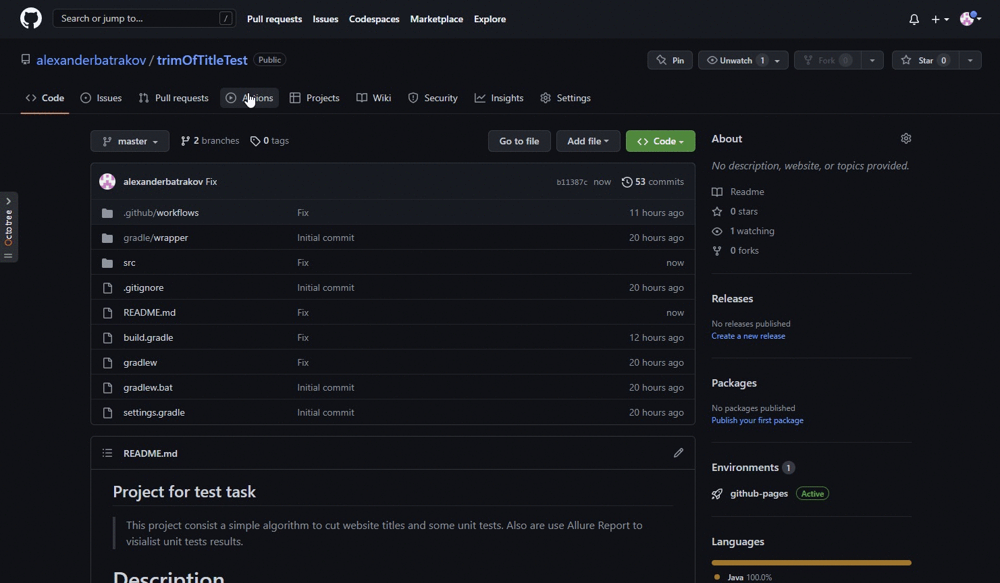
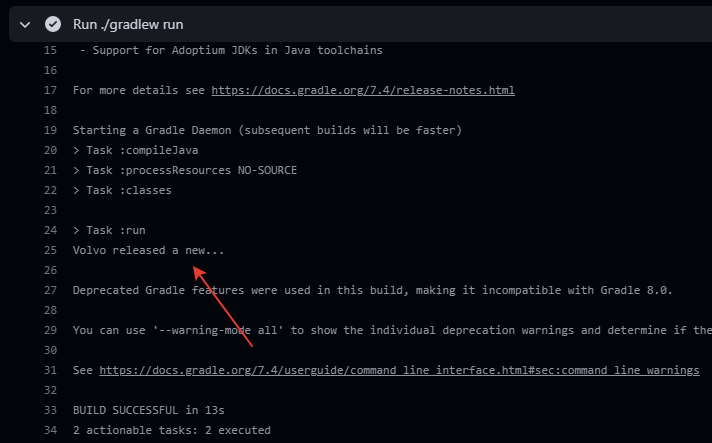
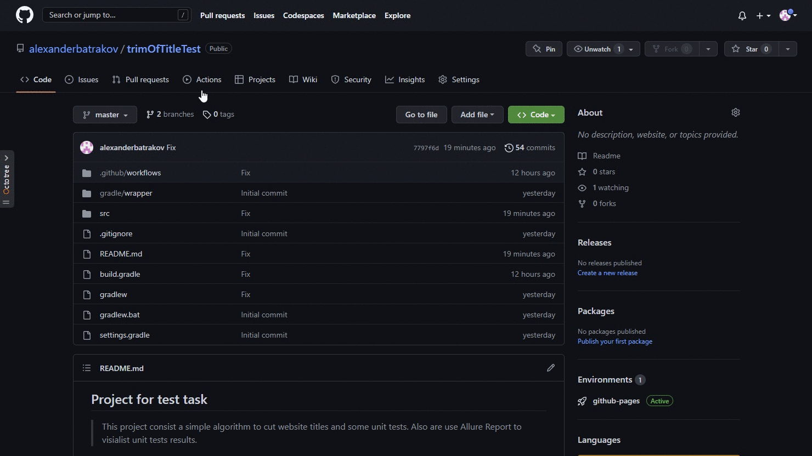
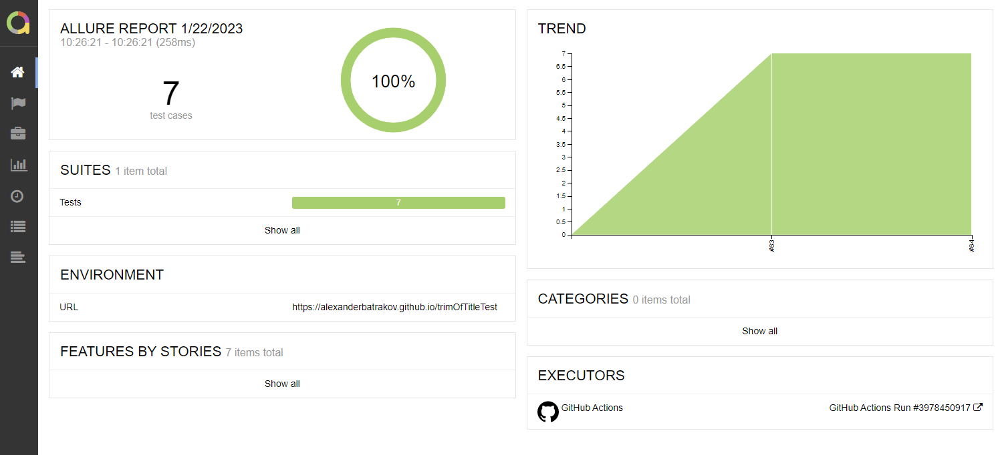
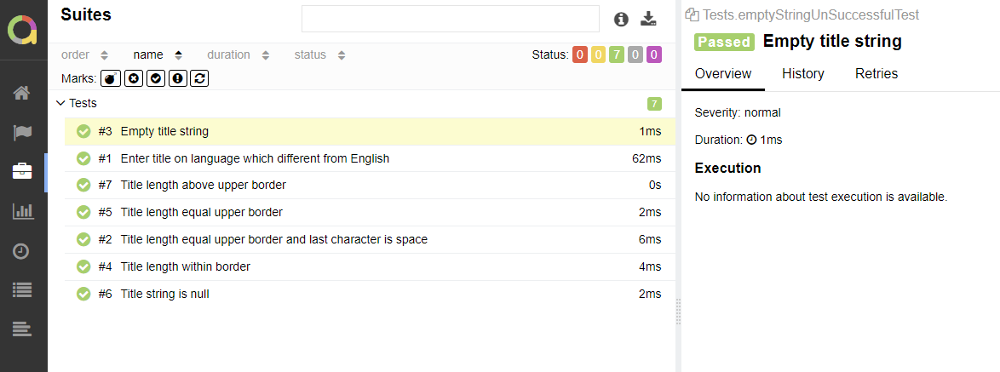

# Project for test task

> This project consist a simple algorithm to cut website titles and some unit tests. Also are used Allure Report to visialist unit tests results.


## <a name="Coverage">Coverage of unit tests</a>

+ Title length above upper border
+ Title length within border
+ Title length equal upper border
+ Title length equal upper border and last character is space
+ Enter title on language which different from English
+ Empty title string
+ Title string is null

## <a name="HowToRun">How to run</a>

### <a name="GradleCommand">Local running</a>

To run locally download project and use command at terminal:


```bash
gradle  run -Dtitle="Volvo released a new car with the following spec: 
V6 236HP. It will cost 22647 and going to be sold in New York" -Dlen=25
```
> - *title* - string for cutting
>- *len* - length of title which will be show on website

To run Unit tests:

```bash
gradle clean test
```

### <a name="Localrun">Remote running</a>

Fot remote running was used GitHub CI. You need to: 

```properties
click to "Actions" -> 
click to "Test" -> 
click to "Run workflow" ->
click to "Run workflow"
```
<p  align="center">

</p>
Results of running you can find under "Run ./gradlew run" task:
<p  align="center">

</p>

## <a name="AllureReport">Test results in [Allure Report](https://alexanderbatrakov.github.io/trimOfTitleTest/64/)</a>

Allure report created after each running of build. You can find result:
```properties
click to "Environment" -> click to "View deploment"
```
<p  align="center">

</p>

Main page of Allure report contains the following blocks:
>- <code><strong>*ALLURE REPORT*</strong></code> - displays date and time of the test, overall number of launched tests
>- <code><strong>*TREND*</strong></code> - displays trend of running tests for all runs
>- <code><strong>*SUITES*</strong></code> - displays distribution of tests by suites
>- <code><strong>*CATEGORIES*</strong></code> - displays distribution of unsuccessful tests by defect types
<p align="center">
  
</p>
On the page contains list of the tests grouped by suites with status shown for each test

<p  align="center">

</p>